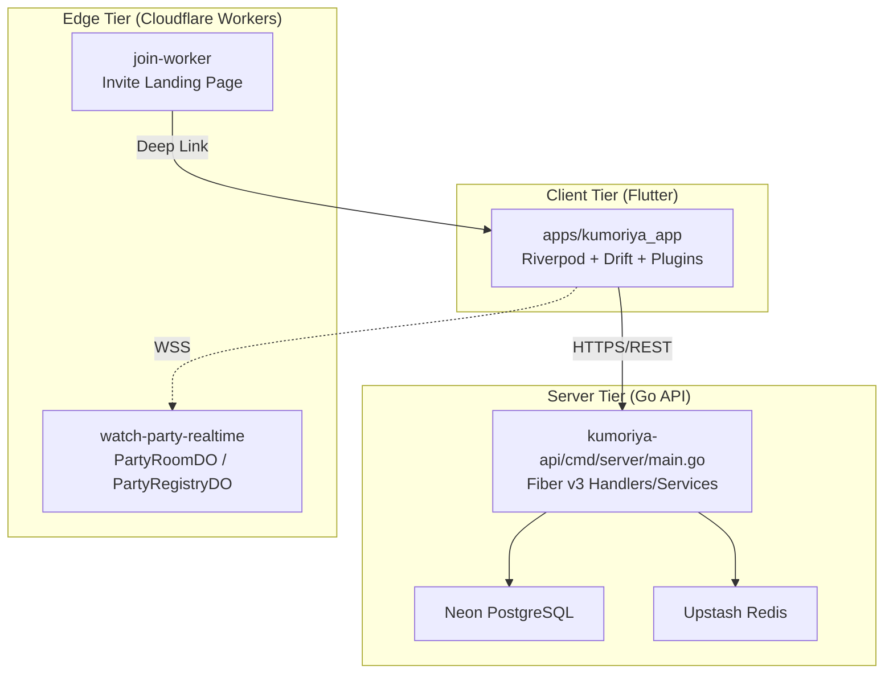
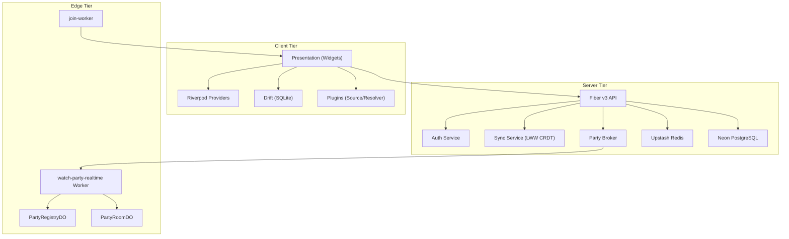
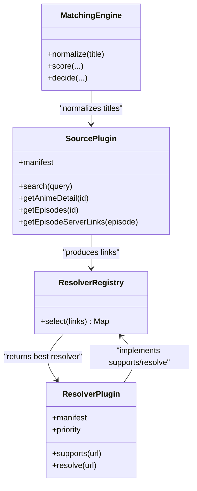
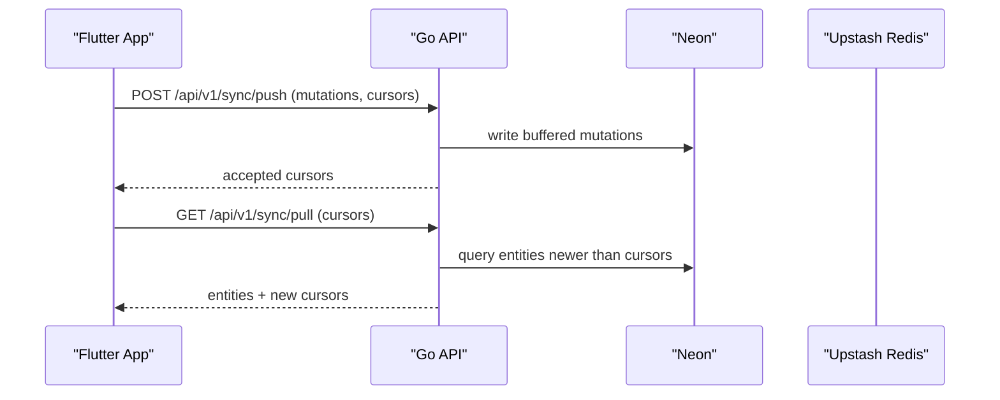
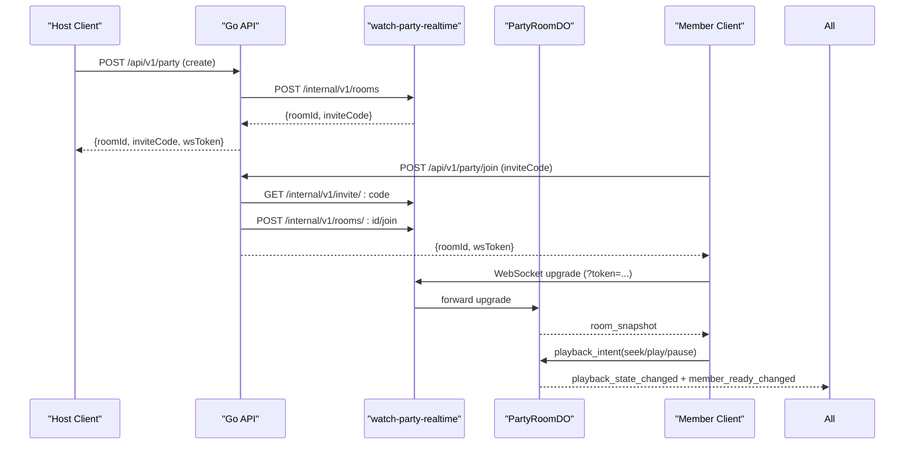
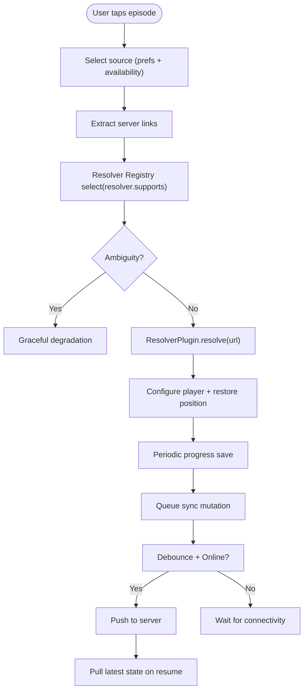
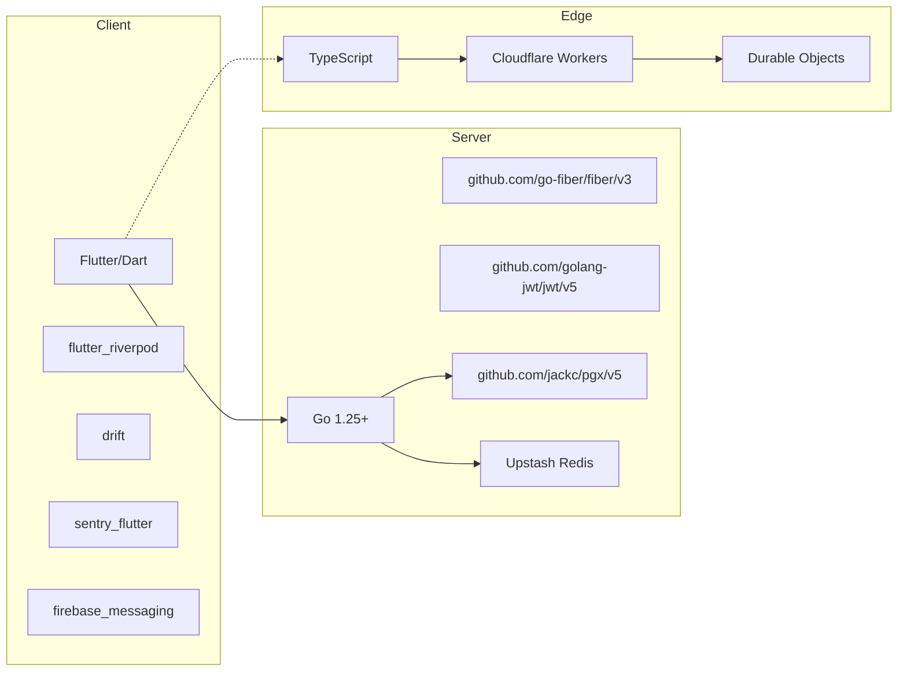

# Architecture

<cite>
**Referenced Files in This Document**
- [ARCHITECTURE.md](file://docs/ARCHITECTURE.md)
- [10-system-design.md](file://docs/10-system-design.md)
- [PLUGIN_SYSTEM.md](file://docs/PLUGIN_SYSTEM.md)
- [DATA_FLOW.md](file://docs/DATA_FLOW.md)
- [EDGE_INFRASTRUCTURE.md](file://docs/EDGE_INFRASTRUCTURE.md)
- [pubspec.yaml](file://apps/kumoriya_app/pubspec.yaml)
- [main.dart](file://apps/kumoriya_app/lib/main.dart)
- [go.mod](file://kumoriya-api/go.mod)
- [main.go](file://kumoriya-api/cmd/server/main.go)
- [config.go](file://kumoriya-api/internal/config/config.go)
- [wrangler.toml](file://infra/watch-party-realtime/wrangler.toml)
- [README.md](file://infra/watch-party-realtime/README.md)
- [wrangler.toml](file://infra/join-worker/wrangler.toml)
</cite>

## Table of Contents
1. [Introduction](#introduction)
2. [Project Structure](#project-structure)
3. [Core Components](#core-components)
4. [Architecture Overview](#architecture-overview)
5. [Detailed Component Analysis](#detailed-component-analysis)
6. [Dependency Analysis](#dependency-analysis)
7. [Performance Considerations](#performance-considerations)
8. [Troubleshooting Guide](#troubleshooting-guide)
9. [Conclusion](#conclusion)
10. [Appendices](#appendices)

## Introduction
This document describes the three-tier distributed architecture of Kumoriya: client tier (Flutter app with Riverpod and plugin architecture), server tier (Go API with microservices), and edge tier (Cloudflare Workers). It explains clean architecture with layered separation, plugin-based extensibility, reactive programming, LWW CRDT synchronization, canonical metadata normalization, and edge computing for real-time features. It also covers infrastructure requirements, scalability, deployment topology, and cross-cutting concerns such as security, monitoring, and disaster recovery.

## Project Structure
Kumoriya is organized as a monorepo with:
- Client: Flutter application with Riverpod state management and a plugin system for sources and resolvers.
- Server: Go API (Fiber v3) microservices for authentication, sync, releases, and watch party orchestration.
- Edge: Cloudflare Workers (Durable Objects) for real-time synchronized watch parties and invite landing.

**Diagram sources**
- [ARCHITECTURE.md:23-87](file://docs/ARCHITECTURE.md#L23-L87)
- [main.go:32-175](file://kumoriya-api/cmd/server/main.go#L32-L175)
- [README.md:1-247](file://infra/watch-party-realtime/README.md#L1-L247)
- [wrangler.toml:1-84](file://infra/watch-party-realtime/wrangler.toml#L1-L84)
- [wrangler.toml:1-5](file://infra/join-worker/wrangler.toml#L1-L5)

**Section sources**
- [ARCHITECTURE.md:19-87](file://docs/ARCHITECTURE.md#L19-L87)
- [10-system-design.md:1-19](file://docs/10-system-design.md#L1-L19)

## Core Components
- Client (Flutter):
  - Riverpod providers for compile-safe, testable state.
  - Drift/SQLite for local persistence with reactive streams.
  - Plugin-first architecture for source and resolver extraction.
  - Sentry for crash reporting and performance tracing.
- Server (Go API):
  - Fiber v3 routes grouped with middleware for CORS, helmet, rate limits.
  - JWT (Ed25519) for secure session tokens.
  - LWW CRDT for multi-device sync.
  - Upstash Redis for deduplication and caching.
  - Airing notifications worker using Firebase Cloud Messaging.
- Edge (Cloudflare Workers):
  - Durable Objects for strong consistency and global low-latency.
  - WebSocket protocol for synchronized playback and voice signaling.
  - Session token authentication with Ed25519.

**Section sources**
- [ARCHITECTURE.md:91-219](file://docs/ARCHITECTURE.md#L91-L219)
- [PLUGIN_SYSTEM.md:20-346](file://docs/PLUGIN_SYSTEM.md#L20-L346)
- [DATA_FLOW.md:190-354](file://docs/DATA_FLOW.md#L190-L354)
- [go.mod:5-14](file://kumoriya-api/go.mod#L5-L14)
- [main.go:32-175](file://kumoriya-api/cmd/server/main.go#L32-L175)
- [README.md:1-247](file://infra/watch-party-realtime/README.md#L1-L247)

## Architecture Overview
Kumoriya’s three-tier architecture enforces clear separation of concerns:
- Client: Presentation, domain, and infrastructure layers with Riverpod and plugins.
- Server: REST API with microservices for auth, sync, releases, and watch party.
- Edge: Real-time orchestration via Cloudflare Workers and Durable Objects.

**Diagram sources**
- [ARCHITECTURE.md:23-87](file://docs/ARCHITECTURE.md#L23-L87)
- [main.go:177-298](file://kumoriya-api/cmd/server/main.go#L177-L298)
- [README.md:1-247](file://infra/watch-party-realtime/README.md#L1-L247)

## Detailed Component Analysis

### Client Tier (Flutter) Analysis
- Clean architecture layers:
  - Presentation: Riverpod providers, pages, widgets, controllers.
  - Domain: Feature slices with use cases and services.
  - Infrastructure: External integrations, clients, plugin runtime.
- State management:
  - Compile-safe provider overrides for testing.
  - Auto-dispose and family providers for dynamic data.
- Local persistence:
  - Drift DAOs, reactive streams, migrations, and typed SQL.
- Plugin system:
  - Contracts define SourcePlugin and ResolverPlugin interfaces.
  - Resolver registry selects resolvers by capability and priority.
  - Matching engine normalizes titles and scores matches.
- Observability:
  - Sentry initialized with performance tracing, ANR detection, and intelligent filtering.

**Diagram sources**
- [PLUGIN_SYSTEM.md:74-227](file://docs/PLUGIN_SYSTEM.md#L74-L227)

**Section sources**
- [ARCHITECTURE.md:91-146](file://docs/ARCHITECTURE.md#L91-L146)
- [PLUGIN_SYSTEM.md:20-346](file://docs/PLUGIN_SYSTEM.md#L20-L346)
- [pubspec.yaml:11-127](file://apps/kumoriya_app/pubspec.yaml#L11-L127)
- [main.dart:30-276](file://apps/kumoriya_app/lib/main.dart#L30-L276)

### Server Tier (Go API) Analysis
- Framework and routing:
  - Fiber v3 with route groups, middleware chains, and per-route rate limits.
- Authentication:
  - JWT (Ed25519) signed tokens, OAuth 2.0 providers, WebAuthn/Passkeys.
- Sync engine:
  - LWW CRDT with durable cursors per user; push mutations with timestamps; pull returns entities newer than client cursor.
- Background workers:
  - Airing notifications worker queries AniList, cross-references library subscriptions, deduplicates with Redis, and sends FCM.
- Watch Party:
  - Optional v2 broker flow to Cloudflare Worker with internal API and session token issuance.

**Diagram sources**
- [DATA_FLOW.md:190-285](file://docs/DATA_FLOW.md#L190-L285)
- [main.go:239-240](file://kumoriya-api/cmd/server/main.go#L239-L240)

**Section sources**
- [ARCHITECTURE.md:148-219](file://docs/ARCHITECTURE.md#L148-L219)
- [DATA_FLOW.md:190-354](file://docs/DATA_FLOW.md#L190-L354)
- [config.go:124-171](file://kumoriya-api/internal/config/config.go#L124-L171)
- [go.mod:5-14](file://kumoriya-api/go.mod#L5-L14)

### Edge Tier (Cloudflare Workers) Analysis
- watch-party-realtime:
  - Entry point routes health, WebSocket upgrade, and internal API.
  - PartyRegistryDO: global registry for invite codes and user-room mapping.
  - PartyRoomDO: per-room authoritative state machine for membership, playback, ready states, and host authority.
  - WebSocket protocol: typed JSON envelopes, ACK/error handling, rate limiting, heartbeat auto-response.
  - Session token authentication: Ed25519-signed JWT verified by Worker.
- join-worker:
  - Invite landing page with deep link fallback, Android Digital Asset Links, and Windows protocol integration.

**Diagram sources**
- [README.md:136-162](file://infra/watch-party-realtime/README.md#L136-L162)
- [wrangler.toml:42-84](file://infra/watch-party-realtime/wrangler.toml#L42-L84)
- [DATA_FLOW.md:461-565](file://docs/DATA_FLOW.md#L461-L565)

**Section sources**
- [EDGE_INFRASTRUCTURE.md:22-480](file://docs/EDGE_INFRASTRUCTURE.md#L22-L480)
- [README.md:1-247](file://infra/watch-party-realtime/README.md#L1-L247)
- [wrangler.toml:1-84](file://infra/watch-party-realtime/wrangler.toml#L1-L84)
- [wrangler.toml:1-5](file://infra/join-worker/wrangler.toml#L1-L5)

### Data Flow and Integration Patterns
- Content discovery: AniList cache → SWR refresh → UI render; fallback to stale cache on failure.
- Episode playback: Source plugin → resolver registry → resolver plugin → player initialization with headers.
- Multi-device sync: LWW CRDT with client-generated monotonic timestamps; durable cursors on server.
- Downloads: HLS or MP4 download strategies with queue management and foreground notifications.
- Notifications: Airing worker with Redis dedup and FCM delivery.
- Watch Party: WebSocket signaling, synchronized playback, ready barriers, and voice signaling via DO.

**Diagram sources**
- [DATA_FLOW.md:128-187](file://docs/DATA_FLOW.md#L128-L187)
- [DATA_FLOW.md:356-418](file://docs/DATA_FLOW.md#L356-L418)

**Section sources**
- [DATA_FLOW.md:40-187](file://docs/DATA_FLOW.md#L40-L187)
- [DATA_FLOW.md:189-354](file://docs/DATA_FLOW.md#L189-L354)

## Dependency Analysis
- Client dependencies:
  - Riverpod, media_kit, Drift, Sentry, Firebase Messaging, WebRTC, Workmanager, and numerous plugins/packages.
- Server dependencies:
  - Fiber v3, JWT, OAuth2, WebAuthn, PostgreSQL driver, Redis client, Firebase Admin SDK.
- Edge dependencies:
  - TypeScript, Vitest, Wrangler, Workers types.

**Diagram sources**
- [pubspec.yaml:11-127](file://apps/kumoriya_app/pubspec.yaml#L11-L127)
- [go.mod:5-14](file://kumoriya-api/go.mod#L5-L14)
- [README.md:1-247](file://infra/watch-party-realtime/README.md#L1-L247)

**Section sources**
- [pubspec.yaml:11-127](file://apps/kumoriya_app/pubspec.yaml#L11-L127)
- [go.mod:5-14](file://kumoriya-api/go.mod#L5-L14)

## Performance Considerations
- Client:
  - Multi-tier caching with TTLs; reactive Drift streams reduce redraw overhead.
  - Plugin registry ambiguity detection prevents unnecessary retries.
- Server:
  - Per-route rate limiting; JWT verification; SWR for AniList home feed.
  - Write-behind flush loop to batch writes to Neon.
- Edge:
  - Heartbeat auto-response bypass reduces billable DO requests by ~95%.
  - Token-bucket rate limiting per message type; deterministic invite code generation.

[No sources needed since this section provides general guidance]

## Troubleshooting Guide
- Client:
  - Sentry beforeSend filters known non-actionable errors; Firebase init failures are non-fatal and logged.
- Server:
  - Missing database credentials disable release publishing; worker initialization warns and proceeds without secrets.
- Edge:
  - Internal endpoints require bearer token; WebSocket token validation failures return 401 with error codes.
  - Durable Objects require enabled accounts and applied migrations.

**Section sources**
- [main.dart:57-76](file://apps/kumoriya_app/lib/main.dart#L57-L76)
- [main.go:111-120](file://kumoriya-api/cmd/server/main.go#L111-L120)
- [README.md:217-235](file://infra/watch-party-realtime/README.md#L217-L235)

## Conclusion
Kumoriya’s architecture balances flexibility and reliability across three tiers. The plugin-first design isolates fragile third-party integrations, Riverpod enables scalable state management, and LWW CRDT simplifies conflict-free multi-device sync. Cloudflare Workers deliver low-latency, strongly consistent real-time orchestration with cost optimization. Together, these choices support a robust, observable, and extensible platform.

[No sources needed since this section summarizes without analyzing specific files]

## Appendices

### Technology Stack and Third-Party Dependencies
- Client:
  - Flutter, Riverpod, Drift, Sentry, Firebase Messaging, WebRTC, Workmanager, media_kit, sqlite3_flutter_libs, and many plugin packages.
- Server:
  - Go 1.25+, Fiber v3, JWT, OAuth2, WebAuthn, PostgreSQL (pgx), Upstash Redis, Firebase Admin SDK.
- Edge:
  - TypeScript, Cloudflare Workers, Durable Objects, Vitest, Wrangler.

**Section sources**
- [pubspec.yaml:11-127](file://apps/kumoriya_app/pubspec.yaml#L11-L127)
- [go.mod:5-14](file://kumoriya-api/go.mod#L5-L14)
- [README.md:1-247](file://infra/watch-party-realtime/README.md#L1-L247)

### Deployment Topology and Infrastructure Requirements
- Server:
  - Fiber app listens on configurable port, with trusted proxy support and CORS configuration.
  - Neon for PostgreSQL, Upstash Redis for caching and deduplication.
- Edge:
  - watch-party-realtime: Worker with PartyRegistryDO and PartyRoomDO, internal and public endpoints, session token verification.
  - join-worker: Invite landing page with deep link fallback and Digital Asset Links.
- DNS and Routes:
  - Configure DNS records for party.kumoriya.online and join.kumoriya.online; enable routes in Cloudflare dashboard.

**Section sources**
- [main.go:32-175](file://kumoriya-api/cmd/server/main.go#L32-L175)
- [README.md:115-147](file://infra/watch-party-realtime/README.md#L115-L147)
- [wrangler.toml:61-84](file://infra/watch-party-realtime/wrangler.toml#L61-L84)
- [wrangler.toml:1-5](file://infra/join-worker/wrangler.toml#L1-L5)