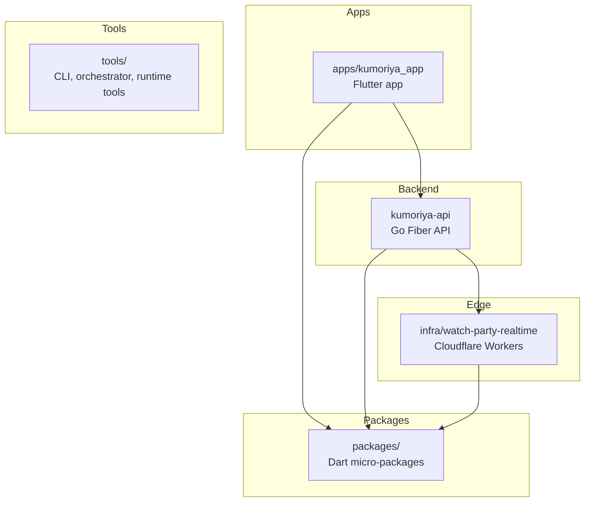
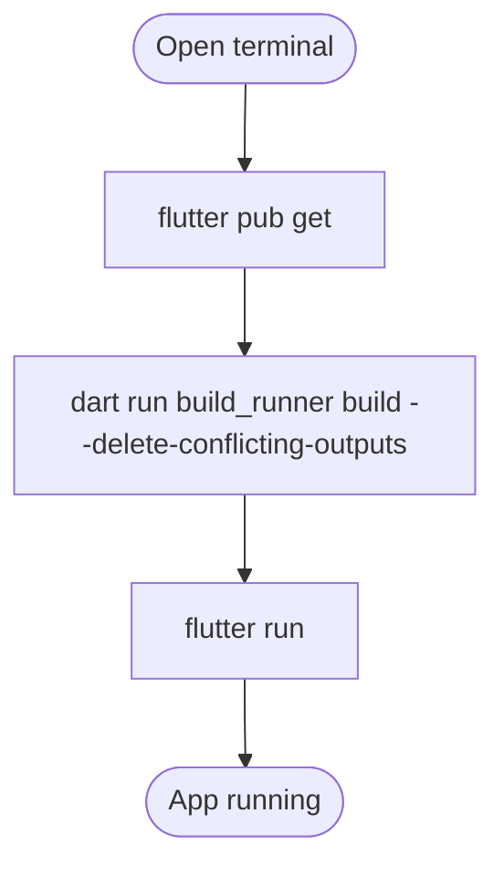
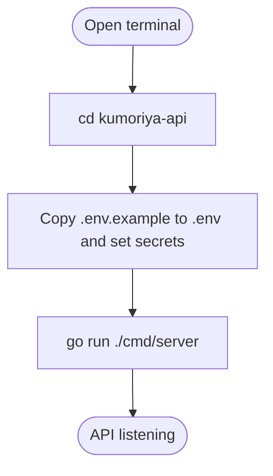
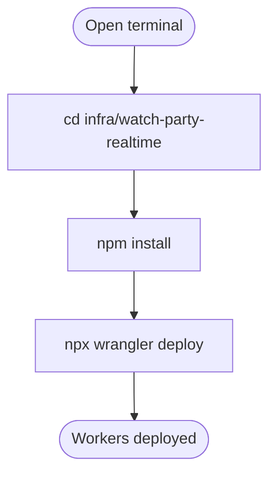
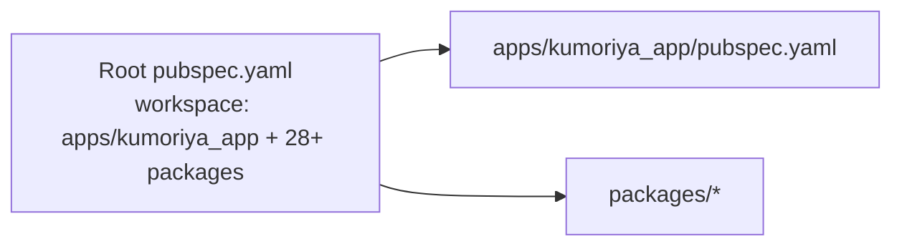
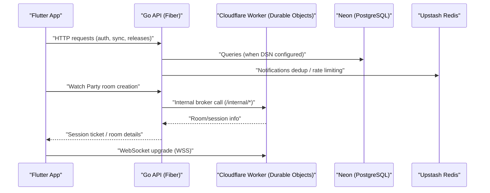
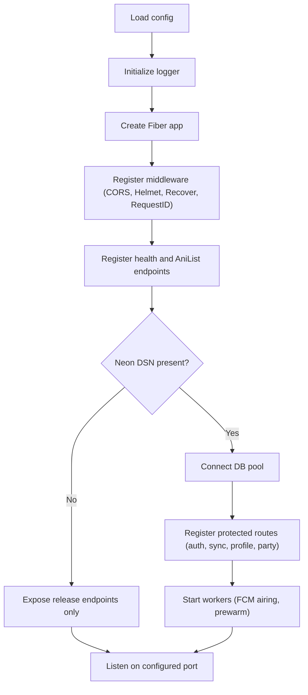

# Getting Started

<cite>
**Referenced Files in This Document**
- [README.md](file://README.md)
- [pubspec.yaml](file://pubspec.yaml)
- [apps/kumoriya_app/pubspec.yaml](file://apps/kumoriya_app/pubspec.yaml)
- [kumoriya-api/go.mod](file://kumoriya-api/go.mod)
- [kumoriya-api/cmd/server/main.go](file://kumoriya-api/cmd/server/main.go)
- [kumoriya-api/internal/config/config.go](file://kumoriya-api/internal/config/config.go)
- [kumoriya-api/Dockerfile](file://kumoriya-api/Dockerfile)
- [apps/kumoriya_app/lib/main.dart](file://apps/kumoriya_app/lib/main.dart)
- [infra/watch-party-realtime/package.json](file://infra/watch-party-realtime/package.json)
- [infra/watch-party-realtime/wranglertoml](file://infra/watch-party-realtime/wranglertoml)
- [packages/kumoriya_core/pubspec.yaml](file://packages/kumoriya_core/pubspec.yaml)
- [tools/resolver_cli/pubspec.yaml](file://tools/resolver_cli/pubspec.yaml)
- [scripts/windows/00-init-clean-repo.ps1](file://scripts/windows/00-init-clean-repo.ps1)
</cite>

## Table of Contents
1. [Introduction](#introduction)
2. [Project Structure](#project-structure)
3. [Prerequisites](#prerequisites)
4. [Quick Start](#quick-start)
5. [Build and Run Instructions](#build-and-run-instructions)
6. [Monorepo Workspace and Dependencies](#monorepo-workspace-and-dependencies)
7. [Architecture Overview](#architecture-overview)
8. [Detailed Component Walkthrough](#detailed-component-walkthrough)
9. [Troubleshooting Guide](#troubleshooting-guide)
10. [Conclusion](#conclusion)

## Introduction
This guide helps you set up the Kumoriya development environment and run all components locally: the Flutter application, the Go backend API, and the Cloudflare Workers edge service. It also explains the monorepo layout, key directories, and how to verify your setup.

## Project Structure
Kumoriya is a monorepo with three primary areas:
- apps/kumoriya_app: Flutter application (Android + Windows)
- kumoriya-api: Go backend service (Fiber)
- infra: Cloudflare Workers and Durable Objects
- packages: Dart packages implementing domain logic and plugins
- tools: Developer utilities (CLI, orchestrator, runtime tools)
- docs: Architecture and design documents
- scripts: Automation and release helpers

**Diagram sources**
- [README.md:67-149](file://README.md#L67-L149)
- [pubspec.yaml:7-60](file://pubspec.yaml#L7-L60)

**Section sources**
- [README.md:67-149](file://README.md#L67-L149)

## Prerequisites
Install these tools and meet the version requirements before proceeding:
- Flutter SDK ≥ 3.32
- Go ≥ 1.25
- Node.js ≥ 20
- Wrangler CLI for Cloudflare Workers

Notes:
- The Flutter workspace targets a minimum SDK of 3.11.1, but the project’s quick start expects Flutter 3.32 or newer for the app.
- The Go module declares Go 1.25.0 as the minimum version.
- The Workers project specifies Node.js 20+ and Wrangler in devDependencies.

**Section sources**
- [README.md:236-240](file://README.md#L236-L240)
- [kumoriya-api/go.mod:3](file://kumoriya-api/go.mod#L3)
- [infra/watch-party-realtime/package.json:23-34](file://infra/watch-party-realtime/package.json#L23-L34)

## Quick Start
Follow these steps to run the entire stack locally:

1) Flutter app
- Install dependencies
- Build code generation
- Run the app

**Diagram sources**
- [README.md:241-246](file://README.md#L241-L246)

2) Go API
- Change to the API directory
- Configure environment variables (copy example file)
- Run the server

**Diagram sources**
- [README.md:248-253](file://README.md#L248-L253)
- [kumoriya-api/cmd/server/main.go:32-175](file://kumoriya-api/cmd/server/main.go#L32-L175)

3) Cloudflare Workers
- Change to the Workers directory
- Install Node.js dependencies
- Deploy with Wrangler

**Diagram sources**
- [README.md:255-260](file://README.md#L255-L260)
- [infra/watch-party-realtime/package.json:6-14](file://infra/watch-party-realtime/package.json#L6-L14)

**Section sources**
- [README.md:234-260](file://README.md#L234-L260)

## Build and Run Instructions

### Flutter Application (apps/kumoriya_app)
- Install dependencies and generate code:
  - flutter pub get
  - dart run build_runner build --delete-conflicting-outputs
- Run on your preferred device/emulator:
  - flutter run

Key behaviors:
- Sentry initialization and performance sampling
- Firebase and FCM setup on Android
- Workmanager periodic tasks for episode checks and sync draining
- Platform-specific media initialization (avoiding Android native libs in desktop media_kit)

Verification:
- Confirm the app starts and navigates to the main screen
- On Android, verify passkey-related assetlinks endpoint is reachable if fingerprints are configured

**Section sources**
- [apps/kumoriya_app/lib/main.dart:30-160](file://apps/kumoriya_app/lib/main.dart#L30-L160)
- [apps/kumoriya_app/lib/main.dart:162-206](file://apps/kumoriya_app/lib/main.dart#L162-L206)
- [apps/kumoriya_app/lib/main.dart:208-257](file://apps/kumoriya_app/lib/main.dart#L208-L257)
- [apps/kumoriya_app/lib/main.dart:259-276](file://apps/kumoriya_app/lib/main.dart#L259-L276)

### Go Backend API (kumoriya-api)
- Build and run:
  - cd kumoriya-api
  - cp .env.example .env (configure secrets)
  - go run ./cmd/server

Highlights:
- Fiber server with CORS, Helmet, request ID, and recovery middleware
- Health endpoints and optional AniList edge cache
- Conditional routes when Neon DSN is present
- Optional FCM airing notifications worker and Upstash Redis dedup
- Watch Party v2 broker mode to Cloudflare Workers

Environment variables (selected):
- PORT, TRUSTED_PROXIES, BASE_URL
- NEON_DSN (optional)
- JWT_PRIVATE_KEY_HEX (Ed25519), JWT_ISSUER
- DISCORD_CLIENT_ID/_SECRET, GOOGLE_CLIENT_ID/_SECRET
- WEBAUTHN_RP_ID, WEBAUTHN_RP_ORIGINS, WEBAUTHN_RP_NAME
- RELEASE_MANIFEST_URL, RELEASE_PUBLISH_TOKEN
- ANDROID_APK_FINGERPRINTS, ANDROID_APK_DEBUG_FINGERPRINTS
- WATCH_PARTY_REALTIME_V2, PARTY_REALTIME_BASE_URL, PARTY_REALTIME_WS_BASE_URL, PARTY_INTERNAL_TOKEN, PARTY_WS_AUDIENCE
- FIREBASE_SERVICE_ACCOUNT_JSON or FIREBASE_SERVICE_ACCOUNT_FILE
- UPSTASH_REDIS_REST_URL, UPSTASH_REDIS_REST_TOKEN

Docker:
- A multi-stage Dockerfile builds a static Linux binary and exposes port 7860

**Section sources**
- [kumoriya-api/cmd/server/main.go:32-175](file://kumoriya-api/cmd/server/main.go#L32-L175)
- [kumoriya-api/cmd/server/main.go:177-298](file://kumoriya-api/cmd/server/main.go#L177-L298)
- [kumoriya-api/internal/config/config.go:86-171](file://kumoriya-api/internal/config/config.go#L86-L171)
- [kumoriya-api/Dockerfile:1-19](file://kumoriya-api/Dockerfile#L1-L19)

### Cloudflare Workers (infra/watch-party-realtime)
- Install dependencies and deploy:
  - cd infra/watch-party-realtime
  - npm install
  - npx wrangler deploy

Configuration:
- Compatibility date and Node.js compatibility flag
- Durable Objects bindings and migrations for PartyRegistryDO and PartyRoomDO
- Environment-specific vars for development and production
- Scripts for dev, deploy, test, lint, format, and type-check

**Section sources**
- [infra/watch-party-realtime/wranglertoml:1-84](file://infra/watch-party-realtime/wranglertoml#L1-L84)
- [infra/watch-party-realtime/package.json:6-14](file://infra/watch-party-realtime/package.json#L6-L14)

## Monorepo Workspace and Dependencies

### Flutter Workspace
- Root pubspec defines a workspace that includes the app and 28+ Dart packages
- The Flutter app depends on many packages under packages/

**Diagram sources**
- [pubspec.yaml:7-60](file://pubspec.yaml#L7-L60)
- [apps/kumoriya_app/pubspec.yaml:6](file://apps/kumoriya_app/pubspec.yaml#L6)

**Section sources**
- [pubspec.yaml:7-60](file://pubspec.yaml#L7-L60)
- [apps/kumoriya_app/pubspec.yaml:11-81](file://apps/kumoriya_app/pubspec.yaml#L11-L81)

### Dart Packages
- packages/kumoriya_core: foundational primitives
- packages/kumoriya_domain, kumoriya_auth, kumoriya_sync, kumoriya_storage, kumoriya_matching
- Source and resolver plugins (e.g., kumoriya_source_*, kumoriya_resolver_*)
- tools/resolver_cli: CLI for testing resolvers

**Section sources**
- [packages/kumoriya_core/pubspec.yaml:1-14](file://packages/kumoriya_core/pubspec.yaml#L1-L14)
- [tools/resolver_cli/pubspec.yaml:10-68](file://tools/resolver_cli/pubspec.yaml#L10-L68)

## Architecture Overview
High-level flow of a typical request path and component interactions:

**Diagram sources**
- [README.md:209-220](file://README.md#L209-L220)
- [kumoriya-api/cmd/server/main.go:244-290](file://kumoriya-api/cmd/server/main.go#L244-L290)
- [infra/watch-party-realtime/wranglertoml:16-33](file://infra/watch-party-realtime/wranglertoml#L16-L33)

## Detailed Component Walkthrough

### Backend API Startup Flow

**Diagram sources**
- [kumoriya-api/cmd/server/main.go:32-175](file://kumoriya-api/cmd/server/main.go#L32-L175)
- [kumoriya-api/cmd/server/main.go:177-298](file://kumoriya-api/cmd/server/main.go#L177-L298)

### Workers Configuration and Deployment
- Durable Objects: PartyRegistryDO and PartyRoomDO
- Migrations tag v1 with SQLite-backed DOs
- Environment blocks for development and production
- Scripts for local dev and CI-friendly deploy

**Section sources**
- [infra/watch-party-realtime/wranglertoml:16-84](file://infra/watch-party-realtime/wranglertoml#L16-L84)
- [infra/watch-party-realtime/package.json:6-14](file://infra/watch-party-realtime/package.json#L6-L14)

## Troubleshooting Guide

Common setup issues and resolutions:

- Flutter SDK version mismatch
  - Ensure Flutter SDK ≥ 3.32; the project’s quick start presumes this.
  - Verify your environment PATH includes the Flutter SDK.

- Go version mismatch
  - The Go module requires Go ≥ 1.25.0.
  - Use a compatible Go version or update your toolchain.

- Node.js and Wrangler
  - Node.js ≥ 20 is required; install LTS.
  - Install Wrangler globally or use npx to run commands.

- API fails to start due to missing environment variables
  - Copy .env.example to .env and fill in required values (see environment variables list in the Go API section).
  - Pay special attention to JWT_PRIVATE_KEY_HEX (must be a valid Ed25519 hex key), NEON_DSN, Firebase credentials, and Upstash Redis credentials.

- Workers deployment issues
  - Ensure wrangler.toml is present and properly configured for your environment.
  - Confirm compatibility_date and compatibility_flags match the project requirements.
  - For environment-specific deployments, redeclare durable_objects.bindings and migrations in the target env block.

- Flutter app not starting or stuck on startup
  - Review Sentry beforeSend filters and ensure no unhandled exceptions block startup.
  - On Android, verify Firebase initialization and passkey assetlinks configuration if applicable.

- Database connectivity
  - If NEON_DSN is empty, the API will run in a limited mode without protected routes.
  - When DSN is present, confirm the connection string is valid and reachable.

- Media playback issues on desktop
  - media_kit initialization is skipped on Android; ensure native libraries are available on Windows/Linux as configured.

**Section sources**
- [kumoriya-api/internal/config/config.go:86-171](file://kumoriya-api/internal/config/config.go#L86-L171)
- [kumoriya-api/cmd/server/main.go:111-147](file://kumoriya-api/cmd/server/main.go#L111-L147)
- [apps/kumoriya_app/lib/main.dart:30-160](file://apps/kumoriya_app/lib/main.dart#L30-L160)
- [infra/watch-party-realtime/wranglertoml:16-33](file://infra/watch-party-realtime/wranglertoml#L16-L33)

## Conclusion
You now have the prerequisites, instructions, and context to set up and run Kumoriya locally across Flutter, Go, and Cloudflare Workers. Use the quick start steps to bring up the stack, refer to the detailed sections for deeper understanding, and consult the troubleshooting guide for common issues. Explore the monorepo structure to learn how packages and tools integrate with the app and backend.