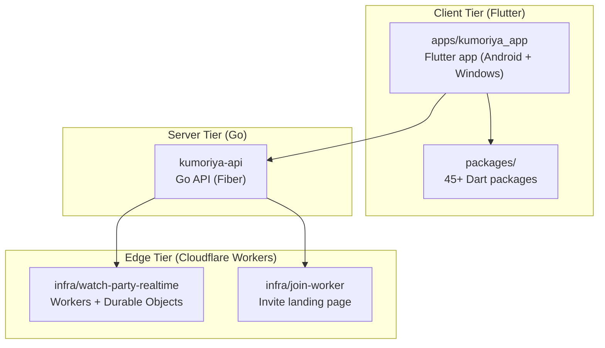
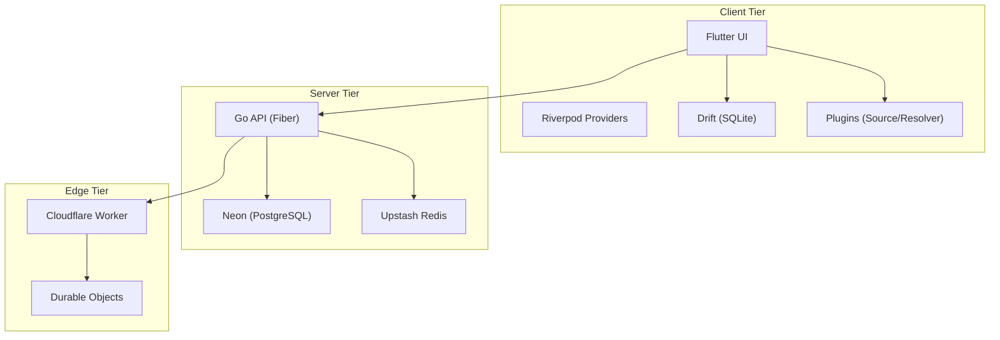
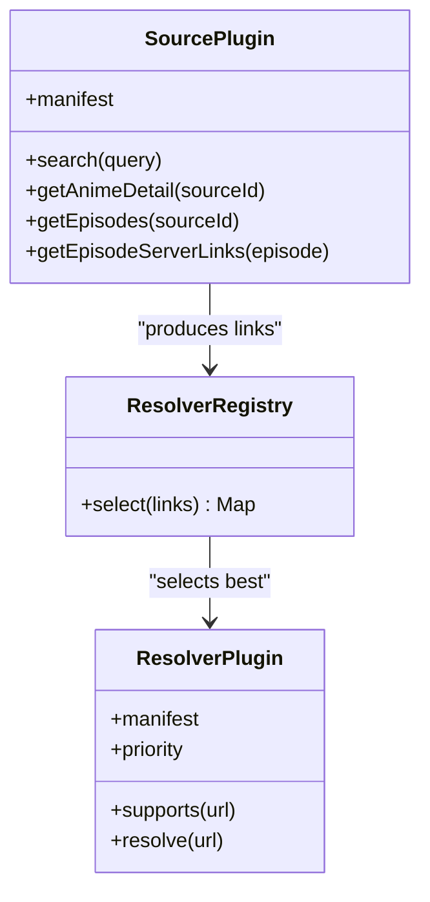
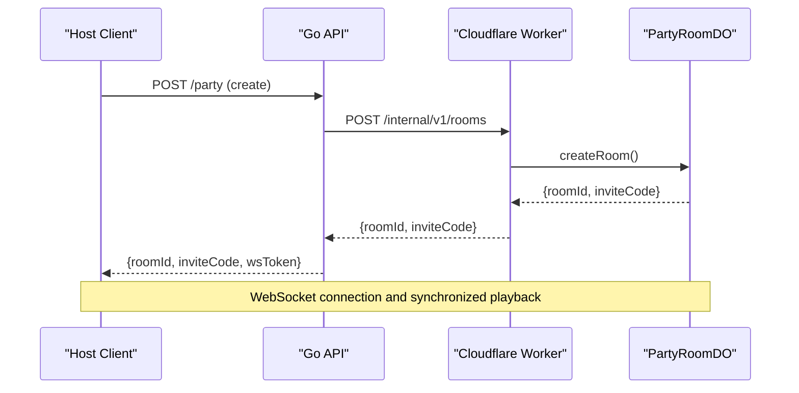
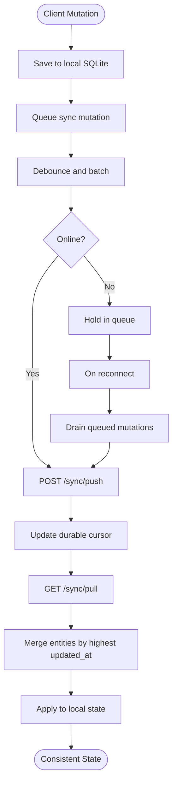
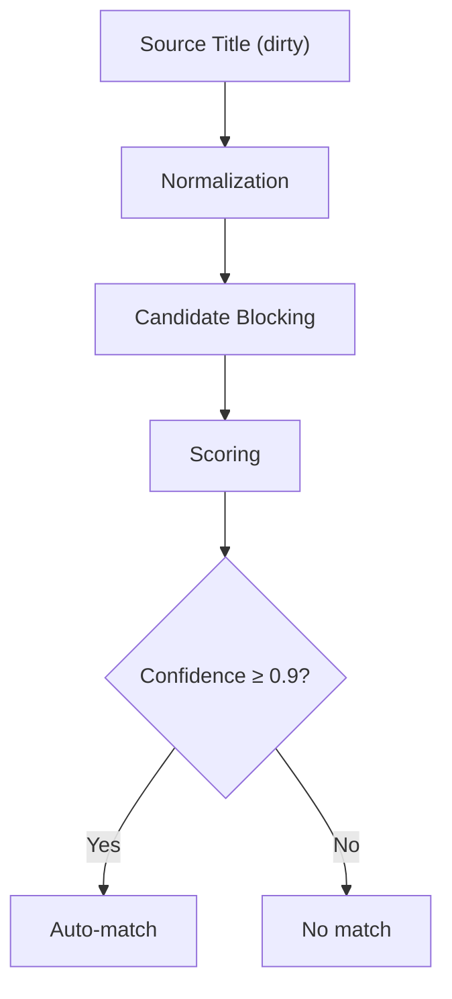
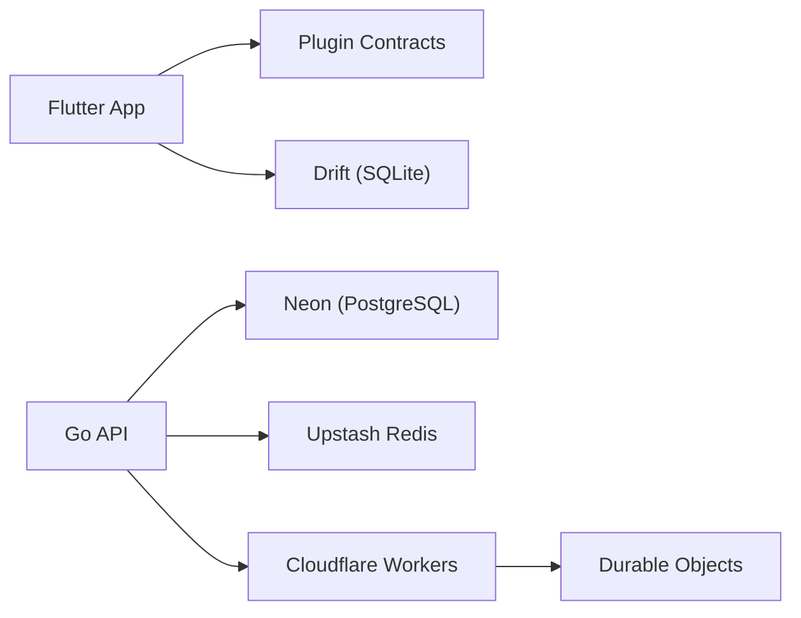

# Project Overview

<cite>
**Referenced Files in This Document**
- [README.md](file://README.md)
- [ARCHITECTURE.md](file://docs/ARCHITECTURE.md)
- [PLUGIN_SYSTEM.md](file://docs/PLUGIN_SYSTEM.md)
- [DATA_FLOW.md](file://docs/DATA_FLOW.md)
- [pubspec.yaml](file://apps/kumoriya_app/pubspec.yaml)
- [main.go](file://kumoriya-api/cmd/server/main.go)
- [README.md](file://infra/watch-party-realtime/README.md)
</cite>

## Table of Contents
1. [Introduction](#introduction)
2. [Project Structure](#project-structure)
3. [Core Components](#core-components)
4. [Architecture Overview](#architecture-overview)
5. [Detailed Component Analysis](#detailed-component-analysis)
6. [Dependency Analysis](#dependency-analysis)
7. [Performance Considerations](#performance-considerations)
8. [Troubleshooting Guide](#troubleshooting-guide)
9. [Conclusion](#conclusion)
10. [Appendices](#appendices)

## Introduction
Kumoriya’s mission is to solve the fragmentation problem in digital content consumption by acting as an aggregation middleware that unifies multiple third-party data sources into a single, cohesive experience. It dynamically extracts, normalizes, and serves content from disparate sources—without users ever needing to know where the data came from. This enables a real-time, cross-platform otaku entertainment platform spanning Android and Windows.

Kumoriya’s value proposition centers on:
- A plugin-first architecture that isolates fragile third-party integrations
- A three-tier distributed system (client, server, edge) for scalability and resilience
- Real-time synchronized viewing powered by edge computing
- LWW CRDT-based synchronization for multi-device state consistency
- Canonical metadata indexing that normalizes unstructured web data into a unified catalog

**Section sources**
- [README.md:14-300](file://README.md#L14-L300)

## Project Structure
Kumoriya is organized as a monorepo with clear separation of concerns across client, server, and edge layers, plus a comprehensive set of Dart packages implementing domain logic, plugins, and infrastructure.

**Diagram sources**
- [README.md:67-149](file://README.md#L67-L149)
- [ARCHITECTURE.md:19-87](file://docs/ARCHITECTURE.md#L19-L87)

**Section sources**
- [README.md:67-149](file://README.md#L67-L149)
- [ARCHITECTURE.md:19-87](file://docs/ARCHITECTURE.md#L19-L87)

## Core Components
- Plugin System: Contracts and implementations for source scraping and stream resolution, enabling graceful degradation and extensibility.
- Matching Engine: Normalizes unstructured web data against canonical metadata to unify catalogs.
- Sync Engine: LWW CRDT-based multi-device synchronization with durable cursors and offline-first design.
- Real-Time Watch Parties: Edge-powered synchronized playback with host authority and graceful member transitions.
- Technology Stack: Flutter/Dart for cross-platform UI, Go for backend services, Cloudflare Workers for edge compute, and modern security practices.

**Section sources**
- [README.md:14-300](file://README.md#L14-L300)
- [PLUGIN_SYSTEM.md:1-346](file://docs/PLUGIN_SYSTEM.md#L1-L346)
- [DATA_FLOW.md:1-591](file://docs/DATA_FLOW.md#L1-L591)

## Architecture Overview
Kumoriya follows a three-tier distributed architecture:
- Client Tier: Flutter app with Riverpod state management, Drift local persistence, and plugin-driven content discovery.
- Server Tier: Go API (Fiber) handling authentication, synchronization, notifications, and watch party orchestration.
- Edge Tier: Cloudflare Workers with Durable Objects for real-time synchronized viewing and invite landing pages.

**Diagram sources**
- [ARCHITECTURE.md:19-87](file://docs/ARCHITECTURE.md#L19-L87)
- [main.go:10-30](file://kumoriya-api/cmd/server/main.go#L10-L30)

**Section sources**
- [ARCHITECTURE.md:19-87](file://docs/ARCHITECTURE.md#L19-L87)
- [main.go:10-30](file://kumoriya-api/cmd/server/main.go#L10-L30)

## Detailed Component Analysis

### Plugin-First Design
Kumoriya’s plugin system decouples UI from concrete implementations, enabling the core app to remain stable despite frequent changes in third-party websites. Contracts define source and resolver behavior; plugins encapsulate extraction logic and stream resolution. The resolver registry selects the best resolver per link with ambiguity detection to avoid incorrect matches.

**Diagram sources**
- [PLUGIN_SYSTEM.md:74-195](file://docs/PLUGIN_SYSTEM.md#L74-L195)

**Section sources**
- [PLUGIN_SYSTEM.md:20-346](file://docs/PLUGIN_SYSTEM.md#L20-L346)

### Real-Time Synchronized Viewing (Watch Party)
Kumoriya leverages Cloudflare Durable Objects to manage authoritative room state, ensuring strong consistency and global low-latency. The system supports host authority, graceful member transitions, synchronized playback barriers, and voice chat signaling via the DO.

**Diagram sources**
- [README.md:209-220](file://README.md#L209-L220)
- [README.md:255-260](file://README.md#L255-L260)
- [README.md:13-14](file://README.md#L13-L14)
- [README.md:45-52](file://README.md#L45-L52)

**Section sources**
- [README.md:209-220](file://README.md#L209-L220)
- [README.md:255-260](file://README.md#L255-L260)
- [README.md:13-14](file://README.md#L13-L14)
- [README.md:45-52](file://README.md#L45-L52)

### LWW CRDT Synchronization
Kumoriya uses Last-Writer-Wins conflict-free replicated data types for multi-device state synchronization. Clients push local mutations with monotonic timestamps; the server persists durable cursors per user and merges updates upon pull, ensuring no data loss during offline periods.

**Diagram sources**
- [DATA_FLOW.md:190-304](file://docs/DATA_FLOW.md#L190-L304)

**Section sources**
- [DATA_FLOW.md:190-304](file://docs/Data Flow & Synchronization.md#L190-L304)

### Canonical Metadata Indexing
Kumoriya normalizes scraped data against canonical metadata via a multi-stage matching pipeline. This acts as a real-time ETL on the client, turning fragmented web data into a unified catalog.

**Diagram sources**
- [PLUGIN_SYSTEM.md:230-289](file://docs/PLUGIN_SYSTEM.md#L230-L289)

**Section sources**
- [PLUGIN_SYSTEM.md:230-289](file://docs/PLUGIN_SYSTEM.md#L230-L289)

### Technology Stack Overview
- Mobile/Desktop: Flutter 3.32 + Dart (Android + Windows)
- State Management: Riverpod 3.x
- Local Database: Drift (SQLite)
- Backend API: Go 1.25 + Fiber v3
- Database: Neon (Serverless PostgreSQL)
- Cache: Upstash Redis (REST)
- Edge Compute: Cloudflare Workers + Durable Objects
- Push Notifications: Firebase Cloud Messaging
- Error Tracking: Sentry
- Background Jobs: Workmanager (Android)
- Media Playback: media_kit + ExoPlayer
- Authentication: WebAuthn (Passkeys) + OAuth 2.0
- Secrets: Ed25519 asymmetric keys
- CI/CD: GitHub Actions
- Release Distribution: Cloudflare R2

**Section sources**
- [README.md:153-172](file://README.md#L153-L172)
- [pubspec.yaml:11-127](file://apps/kumoriya_app/pubspec.yaml#L11-L127)
- [main.go:10-30](file://kumoriya-api/cmd/server/main.go#L10-L30)

## Dependency Analysis
Kumoriya’s dependencies reflect a clean separation of concerns:
- Client depends on plugin contracts and local persistence
- Server depends on database and cache for user data and notifications
- Edge depends on internal tokens and public keys for secure WebSocket upgrades

**Diagram sources**
- [ARCHITECTURE.md:19-87](file://docs/ARCHITECTURE.md#L19-L87)
- [main.go:10-30](file://kumoriya-api/cmd/server/main.go#L10-L30)

**Section sources**
- [ARCHITECTURE.md:19-87](file://docs/ARCHITECTURE.md#L19-L87)
- [main.go:10-30](file://kumoriya-api/cmd/server/main.go#L10-L30)

## Performance Considerations
- Edge-first real-time: Durable Objects eliminate pub/sub infrastructure overhead and provide global low-latency routing.
- Offline-first sync: LWW CRDTs enable seamless reconciliation even after extended offline periods.
- Multi-tier caching: AniList metadata, availability, and translations cached with TTL to reduce latency and API load.
- Background drain: Workmanager ensures sync continues even when the app is closed.
- CDN distribution: Cloudflare R2 hosts APK/MSIX artifacts with update manifests for efficient OTA updates.

[No sources needed since this section provides general guidance]

## Troubleshooting Guide
Common areas to inspect:
- Plugin failures: Prefer no stream over wrong stream; check resolver registry ambiguity and source plugin error boundaries.
- Sync conflicts: Verify client timestamps and server cursors; ensure debounced pushes are being drained.
- Watch Party connectivity: Confirm WebSocket token validation, DNS for party.kumoriya.online, and internal token configuration.
- Notifications: Validate Firebase credentials and Redis dedup setup; confirm topic subscriptions are synced.

**Section sources**
- [PLUGIN_SYSTEM.md:224-227](file://docs/PLUGIN_SYSTEM.md#L224-L227)
- [DATA_FLOW.md:335-353](file://docs/DATA_FLOW.md#L335-L353)
- [README.md:209-220](file://README.md#L209-L220)
- [README.md:255-260](file://README.md#L255-L260)

## Conclusion
Kumoriya uniquely combines a plugin-first architecture, edge-powered real-time collaboration, and LWW CRDT synchronization to deliver a robust, scalable, and user-centric otaku entertainment platform. Its three-tier distributed design, modern security practices, and offline-first philosophy position it as a strong solution for fragmented content ecosystems.

[No sources needed since this section summarizes without analyzing specific files]

## Appendices
- Practical Examples
  - Content Discovery: Home feed loading with cache-first strategy and SWR refresh
  - Episode Playback: Source selection, server link extraction, resolver selection, and player initialization
  - Watch Party: Room creation via Go API, internal Worker call, and WebSocket connection with Durable Objects
  - Sync: Push mutations with timestamps, durable cursor updates, and pull reconciliation

**Section sources**
- [DATA_FLOW.md:40-125](file://docs/DATA_FLOW.md#L40-L125)
- [DATA_FLOW.md:128-187](file://docs/DATA_FLOW.md#L128-L187)
- [DATA_FLOW.md:461-565](file://docs/DATA_FLOW.md#L461-L565)
- [DATA_FLOW.md:190-304](file://docs/DATA_FLOW.md#L190-L304)